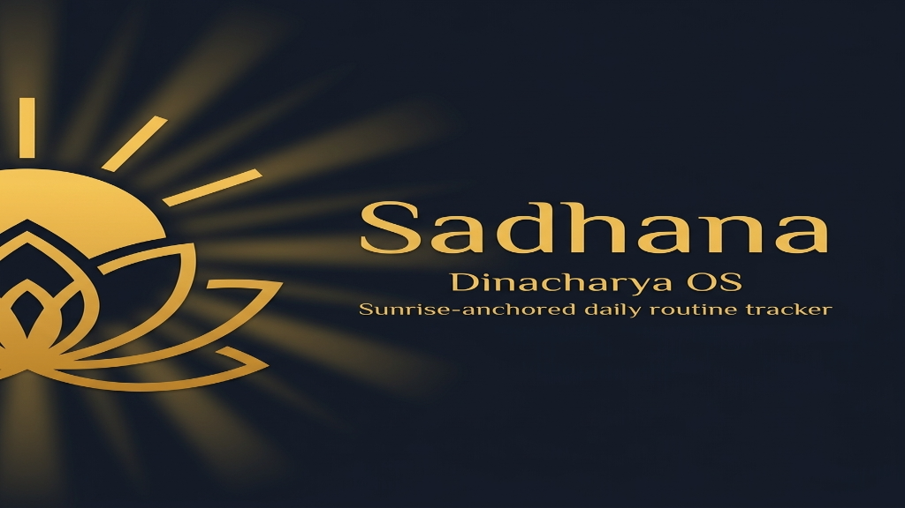
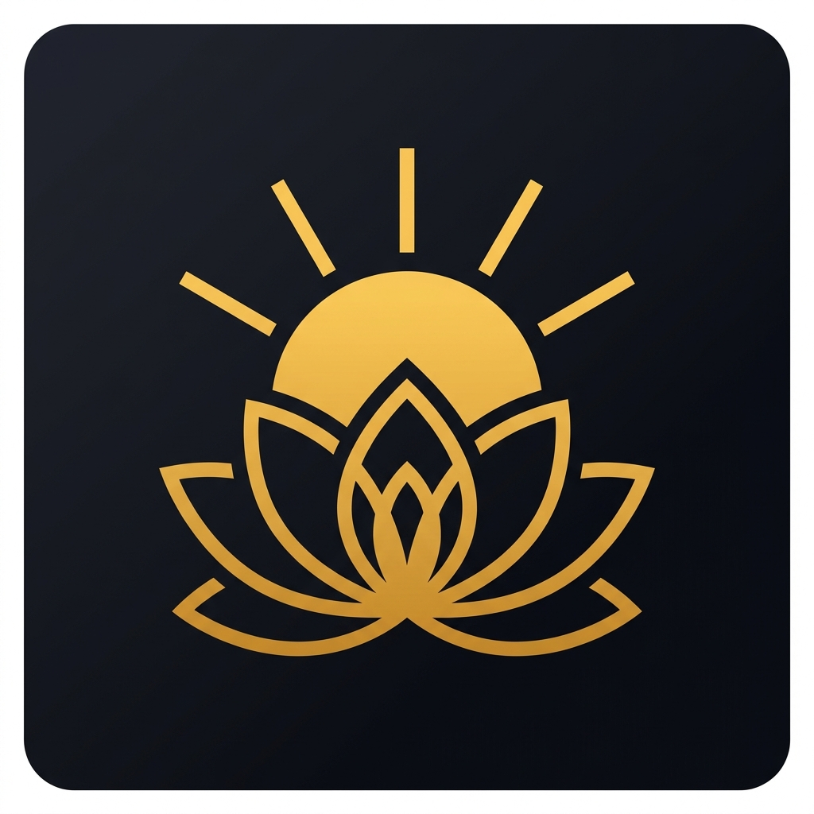
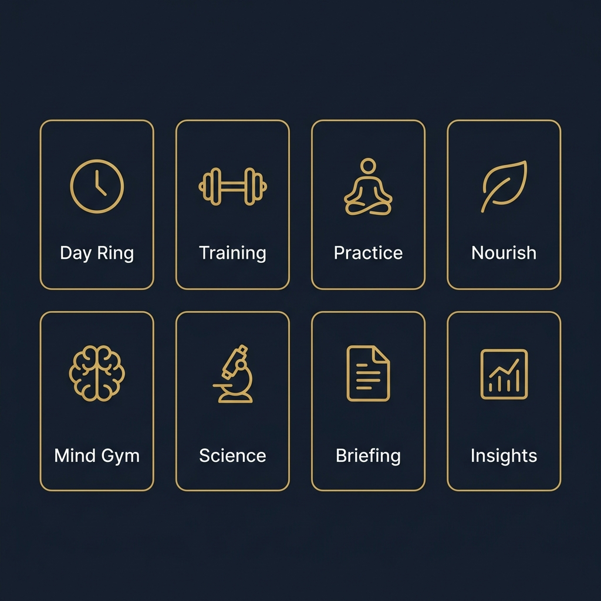
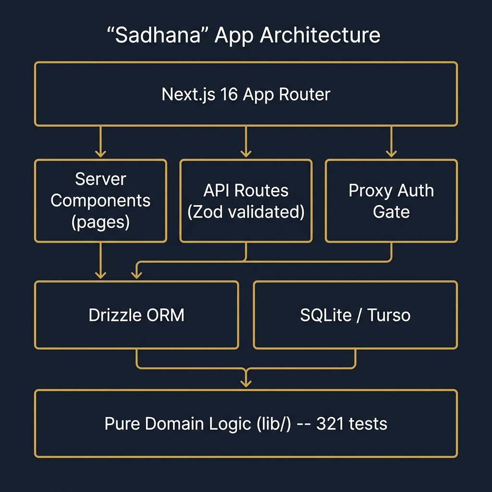

<p align="center">
  
</p>

<p align="center">
  <strong>Sunrise-anchored daily routine tracker</strong><br/>
  Turn an Ayurvedic day into a living, tracked, self-explaining system.
</p>

<p align="center">
  <a href="https://github.com/pavan-io-labs/sadhana/actions/workflows/ci.yml"></a>
  <a href="./LICENSE"></a>
  
  
  
</p>

---

## What It Does

<p align="center">
  
</p>

- **Sunrise-anchored, not clock-anchored.** Brahma Muhurta shifts ~2 hours across Indian cities and seasons. The app computes it from latitude/longitude/date and re-times the whole day automatically.
- **Tracked, so it can be judged.** Adherence, sleep, training load, and PVT reaction time are logged and correlated -- the user sees their own dose-response curve.
- **Self-explaining.** Every block links to an evidence card with an honest tier (Strong / Moderate / Weak / Traditional-only), plus live scholarly search.
- **Assistive.** A rules engine flags conflicts (dinner too close to bed, caffeine past cutoff, heavy lifting fasted) with citations and one-tap fixes. A composed daily Briefing reads as prose.
- **No LLM.** Guidance is deterministic rules + template composition. No API key, no cost, works offline, cannot hallucinate.

---

## Features

<p align="center">
  
</p>

| View | Route | Purpose |
|------|-------|---------|
| **Today** | `/` | Day Ring (24h SVG dial), now/next indicator, one-tap completion, live advisories |
| **Timeline** | `/timeline` | Schedule editor with blocks anchored to sunrise/sunset/wake/bedtime |
| **Train** | `/train` | Progressive overload, deload detection, fuel guidance, session logging |
| **Practice** | `/practice` | Meditation timer, 6 breath techniques, Yoga Nidra (NSDR), Surya Namaskar, Abhyanga |
| **Nourish** | `/nourish` | Meals, caffeine cutoff tracking, hydration, eating window visualization |
| **Mind Gym** | `/mindgym` | 6 cognitive games: PVT, Stroop, N-Back, Go/No-Go, Digit Span, Insight & Reframe |
| **Science** | `/science` | ~40 evidence cards with tier badges, live literature search (Europe PMC + Crossref) |
| **Insights** | `/insights` | Sleep vs PVT scatter, adherence heatmap, the three numbers, forgiving streaks |
| **Briefing** | `/briefing` | Morning & evening composed prose (deterministic, no LLM) |
| **Settings** | `/settings` | Location, chronotype questionnaire (rMEQ), preferences, data export/import |

---

## Architecture

<p align="center">
  
</p>

| Layer | Technology |
|-------|-----------|
| Framework | Next.js 16 (App Router, React 19) |
| Language | TypeScript (`strict`) |
| Styling | Tailwind CSS 4 |
| Database | SQLite via `@libsql/client` + Drizzle ORM |
| Validation | Zod on every API boundary |
| Client Cache | TanStack Query |
| Charts | Recharts |
| Push | web-push + VAPID |
| Tests | Vitest (321 unit tests) |

### Key Design Decisions

| Decision | Record |
|----------|--------|
| SQLite over PostgreSQL | [ADR-001](docs/decisions/001-sqlite-over-postgres.md) |
| No LLM in-app | [ADR-002](docs/decisions/002-no-llm-in-app.md) |
| Anchor-based scheduling | [ADR-003](docs/decisions/003-anchor-based-scheduling.md) |
| Proxy auth gate | [ADR-004](docs/decisions/004-proxy-auth-gate.md) |
| Evidence tiering | [ADR-005](docs/decisions/005-evidence-tiering.md) |

---

## Quick Start

```bash
git clone https://github.com/pavan-io-labs/sadhana.git
cd sadhana
npm install
cp .env.example .env.local    # Edit with your values (optional for local dev)
npm run db:migrate
npm run dev
```

Open [http://localhost:3000](http://localhost:3000). The onboarding flow guides through location, chronotype, and track selection.

---

## Evidence System

Every recommendation carries an honest evidence tier:

| Tier | Badge | Meaning |
|------|-------|---------|
| **Strong** | 🟢 | Multiple RCTs, meta-analyses, or systematic reviews |
| **Moderate** | 🔵 | Some RCTs or consistent observational data |
| **Weak** | 🟡 | Limited studies, small samples, or inconsistent results |
| **Traditional** | ⚪ | Practiced for centuries; limited modern clinical evidence |

~40 curated evidence cards with citations. Live literature search proxies Europe PMC and Crossref for further reading.

---

## Quality Checks

```bash
npx tsc --noEmit        # TypeScript typecheck (0 errors)
npm run lint             # ESLint (0 errors, 0 warnings)
npm run test             # 321 unit tests via Vitest
npm run build            # Production build
```

---

## Documentation

<details>
<summary><strong>Architecture & Design</strong></summary>

- [Architecture Overview](docs/architecture/overview.md)
- [Data Model](docs/architecture/data-model.md) -- all 13 tables with column reference
- [Schedule Engine](docs/architecture/schedule-engine.md) -- anchor-based resolution

</details>

<details>
<summary><strong>Feature Guides</strong></summary>

- [Today (Day Ring)](docs/features/today.md)
- [Training](docs/features/training.md)
- [Practice](docs/features/practice.md)
- [Nourish](docs/features/nourish.md)
- [Mind Gym](docs/features/mindgym.md)
- [Science](docs/features/science.md)
- [Briefing](docs/features/briefing.md)
- [Insights](docs/features/insights.md)

</details>

<details>
<summary><strong>API Reference</strong></summary>

- [All Routes](docs/api/routes.md) -- every method, path, and parameter
- [Validation](docs/api/validation.md) -- Zod schemas, error handling

</details>

<details>
<summary><strong>Operations</strong></summary>

- [Getting Started](docs/getting-started.md)
- [Deployment](docs/operations/deployment.md) -- local, production, Turso, nginx
- [Environment Variables](docs/operations/environment.md)
- [Database](docs/operations/database.md) -- migrations, backup, export/import
- [Troubleshooting](docs/operations/troubleshooting.md)

</details>

<details>
<summary><strong>Cross-Cutting</strong></summary>

- [Testing Strategy](docs/testing.md)
- [Security](docs/security.md) -- threat model, defenses
- [Notifications](docs/notifications.md) -- push, service worker, ICS fallback
- [Integrations](docs/integrations.md) -- Europe PMC, Crossref, NOAA, YouTube

</details>

---

## Contributing

See [CONTRIBUTING.md](CONTRIBUTING.md) for development workflow, branch naming, commit conventions, and quality requirements.

## Security

See [SECURITY.md](SECURITY.md) for the security policy and vulnerability reporting.

## License

[MIT](LICENSE)

---

<p align="center">
  
  <br/>
  <sub>Built with discipline. Tracked with honesty. Explained with citations.</sub>
</p>
